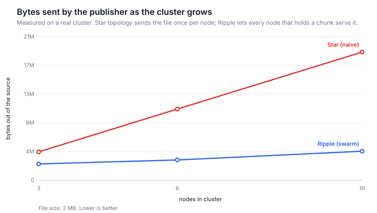
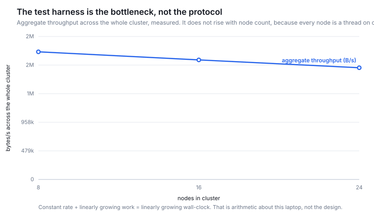
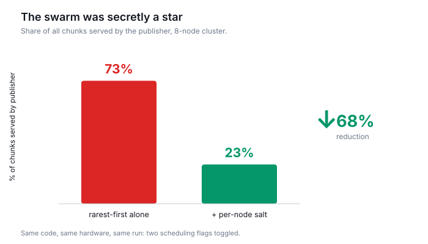
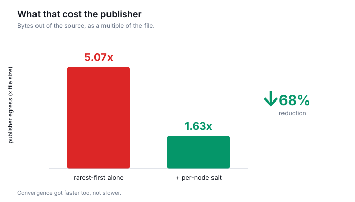
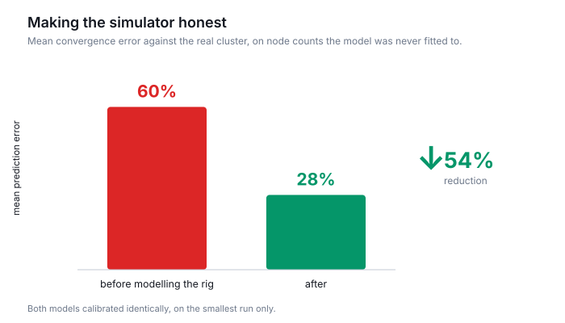

# Ripple — presentation, slide by slide

Eight slides. Slide 5 is the one they remember; everything else exists to set it
up or back it up. Speaker notes are what to *say*, not what to put on the slide.

Numbers marked `[from results/]` are filled in by `python reproduce.py` — check
them against `results/benchmarks.json` before presenting, and never quote a
number the script did not produce.

A ready-to-present HTML version with the real charts embedded is generated by
`python docs/make_deck.py` → `results/deck.html` (press `?` for controls; print
to PDF for a static copy).

---

## 1 — Title

> # Ripple
> ### Cluster file sync that moves meaning first and bytes only when needed
> Nutanix Hackathon · IIT Guwahati · Project Area #2

**Say:** "Keeping files in sync across hundreds of machines. We think the
standard framing of that problem is wrong, and we'd like to show you why."

---

## 2 — The problem, as a number

> **One source. 300 machines. One 10 GB file.**
>
> Naive push: **300 × 10 GB = 3 TB** out of a single NIC
> At 1 GB/s: **50 minutes**, source saturated the whole time
>
> …and most of those bytes are never read.
> *(~80% of a typical container image is never read.)*

**Say:** "Three terabytes to distribute ten gigabytes. And the thing almost
nobody notices: most of that data is never read by the machine it was sent to."

---

## 3 — The reframe

> A file is two things:
>
> | | what it is | size | how we move it |
> |---|---|---|---|
> | **Manifest** | ordered list of content hashes + metadata | **KB** | pushed eagerly, to everyone, now |
> | **Bytes** | the chunks themselves | **GB** | pulled lazily, on first read |
>
> Push the manifest → the file **exists** on all N nodes.
> Right name, right size, right metadata, opens fine.
>
> **`PHANTOM` → `PARTIAL` → `RESIDENT`**

**Say:** "We separate what a file *is* from what it *contains*. The manifest is a
few kilobytes regardless of file size, so we can afford to push it everywhere
immediately. The bytes follow when something actually reads them — and every node
that receives a chunk becomes a source for it, so the second reader is fast too."

**If challenged — and you should invite it:** "This is how modern container image
distribution works. Transferring bytes nobody reads isn't thoroughness, it's
waste. And when you *do* want everything everywhere, you ask for it, and the
swarm still beats a star topology."

---

## 3b — At a size that carries the claim

> | file | manifest | vs file | present on all 50 nodes | first byte |
> |---|---:|---:|---:|---:|
> | 1 GB | 127 KB | 1/8,257 | 1.93 s | 0.21 s |
> | **10 GB** | **641 KB** | **1/16,352** | **4.32 s** | **0.25 s** |
>
> 49 of 49 receivers are **PHANTOM** — the file is present and readable while
> holding **zero bytes**. The read was verified byte-for-byte against the original.
>
> Local ingest on the publisher: 111 minutes at 1.6 MB/s. A one-time cost on one
> machine, not part of the sync. Stated, not hidden.

**Say:** "Eight megabytes doesn't carry this claim, so we ran it at ten gigabytes
across fifty real nodes. Six hundred and forty-one kilobytes of manifest — one
sixteen-thousandth of the file — and it's present on all fifty machines in four
point three seconds. Forty-nine of them are holding none of it. Then we read four
kilobytes from the middle on a node with nothing, in a quarter of a second, and
checked the bytes against the original file."

**Volunteer the cost:** "Chunking and hashing ten gigabytes in Python took the
publisher an hour and fifty minutes. That's one-time, on one machine, and it's
the clearest place a Go rewrite would pay off — but it's real, so we report it."

**And volunteer the bug it found:** "Running at a real size is also how we caught
our own worst error. We'd claimed a 10 GB file has a 90 KB manifest. At a fixed
8 KB chunk it's ninety-two *megabytes* — we were wrong by a factor of a thousand.
Manifest size tracks chunk count, so chunk size has to scale with file size.
That's why the number on this slide is 641 KB and not 92 MB."

---

## 4 — Architecture

> ```
> L4  Correctness      version vectors · Merkle anti-entropy · scrub
> L3  Swarm            rarest-chunk-first · rack/RTT-aware · Bloom summaries
> L2  Propagation      gossip · PHANTOM/PARTIAL/RESIDENT · prefetch
> L1  Content store    SHA-256 addressed · cluster-wide dedup · atomic writes
> L0  Chunking         gear rolling hash · FastCDC normalisation
> ```
>
> Python 3, **standard library only**. No dependencies.

**Say (one sentence per layer, do not linger):** "Content-defined chunking so an
insertion doesn't reshuffle the file. Content addressing so dedup is automatic
and integrity is intrinsic. Gossip so propagation is log-N. Rarest-first so the
publisher doesn't become the bottleneck. Version vectors and Merkle trees so we
never silently lose an edit."

---

## 5 — THE CHART: source egress vs cluster size

> 
>
> **Star topology: linear. Ripple: flat.**
> Measured on a real cluster — both lines are this same code, one configured to
> behave the naive way.

**Say:** "This is the whole argument. The diagonal is what you get when the source
pushes to everyone. The flat line is what you get when every node that has a
chunk can serve it. Same code, same machine — we ran the naive design as a
control rather than drawing it on a slide."

*This is the slide to slow down on. Everything else can be brisk.*

---

## 6 — Does it hold at 1,000 nodes?

> 
>
> **Our validation failed first — and that was the useful part.**
>
> Real convergence grew *linearly* with N; the model said sublinear. We measured
> why: aggregate throughput across the whole cluster is **pinned at ~2 MB/s** no
> matter how many nodes run. Every "node" is a thread in one Python process on
> one machine. Constant rate + linearly growing work = linear wall-clock. We were
> measuring the test rig.
>
> Every node count is run **3×**, median taken, and the run-to-run spread reported
> as a **noise floor: 11.6%**.
>
> | | error | |
> |---|---:|---|
> | **Source egress** — what the claim rests on | **9.1%** | **at/below the noise floor** |
> | Convergence time | 27.6% | residual named, not fitted |
> | Same model, harness not modelled | 60.2% | the version that failed |

**Say:** "A laptop runs maybe fifty real nodes before you're measuring thread
scheduling instead of the protocol. Our first validation caught exactly that. We
could have tuned the model until it agreed — instead we measured what the harness
was doing, found it saturated at two megabytes a second regardless of node count,
and modelled that explicitly."

**Then the part that matters, and say it before they ask how accurate is
accurate:** "We also measured how much the benchmark moves when you just run it
again — eleven point six percent. Our egress error is nine. That's the number the
scaling claim rests on, and it's below the noise floor of the thing we're
validating against. Convergence is still 28% off, and we know why: the harness's
own throughput decays as node count rises and our model holds it constant. We
could fit that and drive the number down — it would make the model better at
predicting this laptop and no better at predicting a cluster. So we report it
instead."

*If a judge pushes on the projection, agree with them. The honest position is the
strong one: the traffic behaviour is measured and at the noise floor; the
wall-clock projection is an extrapolation and we label it as one.*

---

## 6b — Three times we were wrong, and how we found out

> 
> 
> 
>
> **73% → 23%** publisher share · **egress 5.1× → 1.6×** · **simulator error 60% → 28%**
>
> The first two are an **ablation you can re-run** — two scheduling flags toggled
> in the same benchmark. The third is `validate.py` refusing to endorse its own
> model.

**Say:** "Three numbers, each one us catching ourselves. Our swarm was secretly a
star — the publisher was serving nearly three-quarters of all chunks, because our
tiebreak was identical on every node, so all ten walked the same order and nobody
had anything to trade. Our simulator agreed with us for the wrong reason. None of
these were found by thinking harder; all three came from measuring something we'd
already claimed."

**And the fourth, if they engage:** "We also built super-seeding — the textbook
answer here — measured it, and it made things slightly worse. It ships off by
default. We'd rather ship what we measured than what we read about."

*This slide is why the rest of the deck should be believed. Don't rush it.*

---

## 7 — Fault tolerance, demonstrated not asserted

> | we break | it does |
> |---|---|
> | kill the publisher once the swarm holds every chunk | converges anyway — every holder is a source |
> | lose 40% of nodes | converges anyway |
> | corrupt a chunk on disk | scrub detects it (name = checksum), re-fetches, unprompted |
> | partition, then heal, with edits on both sides | keeps **both** versions, converges on one winner |
> | drop gossip messages | Merkle anti-entropy repairs at log cost |
>
> **All of it is a button on the dashboard. Pick one.**

**Say:** "We built the failure injection into the dashboard as controls. Claiming
fault tolerance is easy — so pick something and let's break it now."

**Be precise about the publisher case, because a good judge will probe it:** the
publisher stops being special the moment every chunk exists somewhere else. Kill
it before that and the chunks that existed in exactly one place are gone — that
is replication factor, not protocol, and no system beats it. Our benchmark
measures the time to full swarm coverage and kills the publisher after. Erasure
coding is what would shorten that window.

*Then actually let them. This is the moment that lands.*

---

## 7b — Config drift, answered from metadata alone

> ```
> $ cluster.show_drift("/etc/db.yaml")
>   max_connections: 4 node(s) agree
>     max_connections   differs on n003 -> max_connections: 200
>
> bytes fetched across whole cluster: 0
> ```
>
> Files with a grammar are chunked on the grammar — one chunk per top-level key,
> each carrying a label. Manifests are already on every node, so **comparing them
> names the drifted key**.

**Say:** "Content-defined chunking tells you byte offset 8,214 differs, which
helps nobody. So for files with a grammar we cut on the grammar instead — one
chunk per setting, each labelled. Every node already has every manifest, so
finding which node drifted, on which key, to what value, is a comparison of
metadata already in memory. Zero file bytes moved. Only the differing stanza is
ever fetched, and only to print it."

*This is the second demo beat, and it isn't about bandwidth. Cluster config drift
is something Nutanix sells against.*

---

## 8 — Learnings, limits, next

> **Learned:** rolling hashes and why boundaries must follow content · gossip and
> log-N propagation · why Bloom false positives are cheap but false negatives
> would be fatal · Merkle anti-entropy · that a simulator is worthless until you
> try to falsify it.
>
> **Limits, stated plainly:** the 1,000-node number is simulated (validated,
> labelled) · Python bounds throughput, not the shape of any curve · `edit()`
> rewrites locally to re-chunk · no encryption or access control.
>
> **Next:** erasure-coded fragments (ask for *any k fragments* — deletes the
> scheduling problem) · similarity-based delta for unseen files ·
> structure-aware chunking so config diffs read semantically.

**Say:** "The most useful thing we learned is that the simulator was worthless
until we tried to prove it wrong — our first version agreed with us because it
was quietly sharing state between nodes that had no business knowing it."

---

## Q&A — have these ready

Each team member should be able to answer for their own layer.

**"Why content-defined chunking instead of fixed blocks?"**
Insert one byte at the front and every fixed block shifts — full resend. Ours:
99.8% chunk reuse after a 1-byte prepend, measured.

**"What happens if two nodes gossip the same chunk simultaneously?"**
Chunks are immutable and named by their own hash, so a duplicate arrival is a
no-op — the store already has those exact bytes under that exact name. Concurrent
*manifest* edits are the real question: version vectors detect that neither
dominates, we keep both, and pick a winner by digest so every node picks the same
one with no coordination.

**"Why gossip instead of a coordinator?"**
A coordinator is one more thing to make highly available, and its failure mode is
the whole cluster. Gossip has no load-bearing node and costs one extra round per
doubling.

**"What stops a malicious or broken node poisoning the cluster?"**
Every chunk is verified against its claimed hash before storage. A node cannot
hand you bytes that aren't what they claim to be. (Authentication is not in
scope; integrity is.)

**"Isn't the Bloom filter's false positive rate a problem?"**
It costs one wasted request, answered with `chunk_miss`, and we record the exact
answer so we never ask again. False negatives would be a correctness bug — Bloom
filters can't produce them.

**"How is rollback that fast?"**
It isn't a restore. Manifests are immutable and content-addressed, chunks are
never overwritten, so rolling back is a pointer swap plus a gossip round.
Independent of file size.
